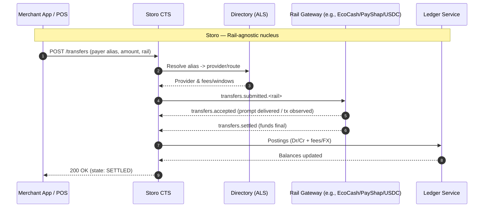
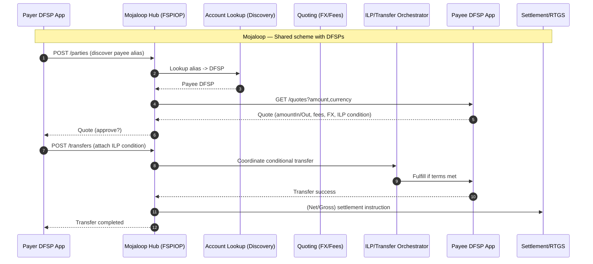

# Storo Nucleus vs Mojaloop Hub - Visual Contrast

This note shows how **Storo** is *inspired by* Mojaloop while keeping a **modular, rail-agnostic nucleus**. Two diagrams:
1) Component landscape comparison
2) Transaction flow (Request-to-Pay) mapped to each architecture

---

## 1) Component Landscape

```mermaid
flowchart LR
  subgraph S["Storo Nucleus (Modular, Rail-Agnostic)"]
    direction LR
    S1[CTS<br/>(Canonical Transfer Service)]
    S2[Rail Gateways<br/>(EcoCash/PayShap/OPPWA/USDC)]
    S3[Ledger Service<br/>(Double-Entry)]
    S4[Compliance<br/>(Screening/Lists)]
    S5[Directory & Routing<br/>(ALS/Fees/Windows)]
    S6[Reconciliation & Returns]
    S7[Event Bus + Outbox]
    S8[Operator Console]
    S9[Platform/Base<br/>(Admin/Time/Errors/IDs)]
  end

  subgraph M["Mojaloop Hub (Switch + Scheme Services)"]
    direction LR
    M1[Account Lookup Service<br/>(ALS / Discovery)]
    M2[Quoting Service<br/>(FX / Fees Agreement)]
    M3[Central Ledger<br/>(Clearing/Positions)]
    M4[Settlement Module<br/>(RTGS/Net/Prefund)]
    M5[Scheme Rules & Auth<br/>(PKI, Signatures, Consent)]
    M6[Fraud/Risk Hooks]
    M7[FSPIOP API Gateway]
    M8[ILP Coordinator<br/>(Conditions/Fulfillment)]
  end

  %% Storo internals
  S1 --> S4
  S1 --> S5
  S1 --> S2
  S2 --> S7
  S7 --> S3
  S7 --> S6
  S8 --- S7
  S9 --- S1
  S9 --- S2
  S9 --- S3

  %% Mojaloop internals
  M7 --> M1
  M7 --> M2
  M7 --> M8
  M8 --> M3
  M3 --> M4
  M5 --- M7
  M6 --- M7
```

**Key differences**  
- **Storo** separates **rail adapters** (gateways) from the core; ledger is **internal SoT**.  
- **Mojaloop** is a **shared switch**: it offers discovery, quoting, clearing & settlement to **external DFSPs**.  
- Both use **directories (ALS)**, **FX/fees agreement**, **security (PKI)**, and **fraud hooks** — but Storo keeps them inside its nucleus; Mojaloop exposes them as scheme services.

---

## 2) Request-to-Pay (R2P) Flow — Side-by-Side





**Interpretation**  
- **Storo** treats R2P as an internal orchestration; **gateways** perform the last-mile prompt/observe/settle.  
- **Mojaloop** formalizes **Discovery -> Quote -> Transfer** across **multiple DFSPs**, with **ILP** ensuring atomicity and a separate **settlement layer**.

---

## When to use which ideas

- Use **Storo’s modular gateways** when you must integrate diverse rails (EcoCash, PayShap, OPPWA, USDC) *and* keep a single internal ledger of record.  
- Use **Mojaloop patterns** (FSPIOP, ILP, ISO 20022 mapping, scheme rules) to standardize cross-institution flows and future-proof for **regional interop**.

---

*Draft v1 — for internal architecture review.*
