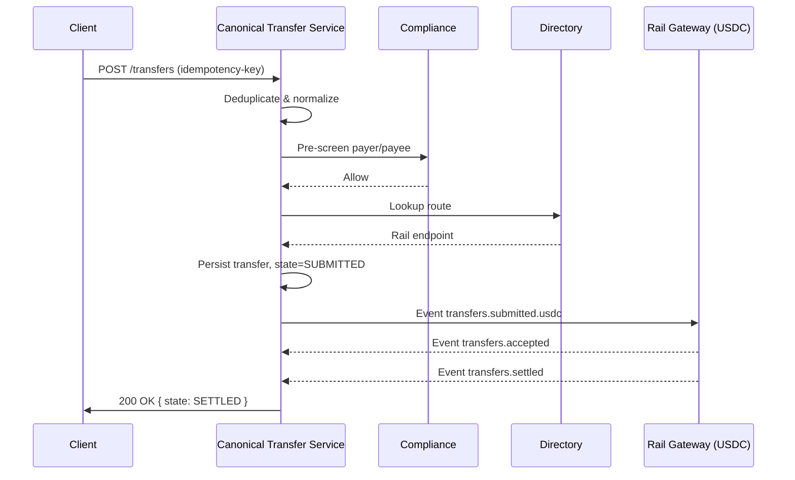

# Canonical Transfer Service (CTS)

The **Canonical Transfer Service (CTS)** is the **front door and conductor** of Storo.  
It provides a single API for creating and managing transfers, normalizes requests into a canonical format, enforces idempotency, screens entities, routes transfers, and emits domain events.

---

## 🎯 Purpose

- Provide a **unified API** for all transfers (payments, payouts, pushes, pulls).  
- Normalize requests into a **canonical model** independent of rail quirks.  
- Act as the **orchestrator** for transfer lifecycle events.  
- Enforce **idempotency** across client submissions.  
- Ensure **compliance screening** before any transfer reaches a rail.  
- Emit **domain events** (`transfers.*`) so all state changes are visible and auditable.  

---

## 🛠 Responsibilities

- **Accept API requests** (`POST /transfers`, `GET /transfers/:id`).  
- **Deduplicate** requests using idempotency keys and hashes.  
- **Validate and normalize** inputs into the canonical transfer schema.  
- **Pre-screen** payer and payee using the Compliance service.  
- **Route** transfers through the Directory & Routing service.  
- **Emit events** (`initiated`, `submitted.<rail>`) via the outbox.  
- **Track lifecycle state** for each transfer.  

---

## 🔌 Interfaces

### API Endpoints
- `POST /transfers`  
  - Create a new transfer.  
  - Requires `Idempotency-Key` header.  
  - Body: canonical transfer schema.  

- `GET /transfers/:id`  
  - Fetch transfer details including timeline of events.  

### Event Topics
- Emits:
  - `transfers.initiated`
  - `transfers.submitted.<rail>`
- Consumes:
  - `transfers.accepted`
  - `transfers.settled`
  - `transfers.returned`
  - `transfers.failed`

---

## 🗄 Data Model

**Table: `transfers`**  
- `transferId` (PK)  
- `tenantId`  
- `payer`, `payee` (JSON)  
- `amount { value, currency }`  
- `rail`  
- `intent` (AUTH | CAPTURE | PUSH | PULL)  
- `externalRef`  
- `state` (INITIATED, SUBMITTED, …)  
- `createdAt`, `updatedAt`  

**Table: `transfer_events`**  
- `eventId`  
- `transferId` (FK)  
- `type`  
- `payload` (JSON)  
- `occurredAt`  

**Table: `outbox_transfers`**  
- Standard outbox pattern for exactly-once event publishing.  

---

## 📐 Diagram

### Sequence: Happy Path (USDC transfer)

---

## 🚨 Failure Modes & Retries

- Duplicate submission → return existing transfer (idempotent).  
- Compliance = deny → return 422 EntityDenied.  
- Directory lookup fails → return 502 RoutingUnavailable.  
- Rail submission fails → state = FAILED, event emitted.  
- Outbox publish failure → retry with exponential backoff.  

---

## 📊 Observability

**Metrics**  
- API latency (p95, p99).  
- Idempotency collision rate.  
- Compliance check latency.  
- Transfers by state (submitted, settled, returned).  

**Logs**  
- Structured JSON with transferId, tenantId, eventId.  

**Tracing**  
- Propagate request IDs through to gateways and ledger.  

---

## 🔐 Security

- API authentication with tenant-level keys/tokens.  
- All PII (payer/payee) encrypted at rest.  
- Access to transfer data restricted by tenant scope.  
- Logs redact sensitive fields (names, IDs, PANs).  

---

## 📘 Runbooks

- If API latency spikes → check compliance and directory service dependencies.  
- If transfers stuck in SUBMITTED → inspect gateway outbox and retry queue.  
- If idempotency collisions increase → confirm client integration is using stable Idempotency-Key.  
- If compliance service is unreachable → all submissions should fail-safe (no unscreened transfers).  
