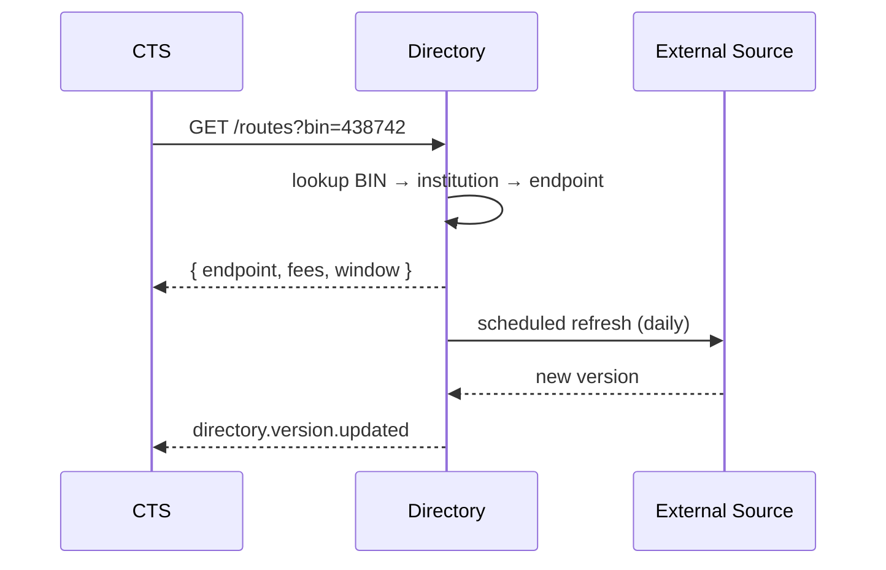

# Directory & Routing Service

The **Directory & Routing Service** is Storo’s authoritative source of rails metadata. It ensures transfers are routed deterministically to the correct rail endpoints, institutions, and fee structures.

---

## 🎯 Purpose
- Maintain authoritative directory of **institutions, BINs, fees, settlement windows**.  
- Provide fast lookups for CTS routing decisions.  
- Refresh data periodically from external sources.  
- Support effective-dated changes (versioning).

---

## 🛠 Responsibilities
- Store and expose institution metadata.  
- Expose routing lookups (`/routes?bin=...`) for CTS.  
- Apply per-rail/per-tenant fees and cutoffs.  
- Circuit-breaker fallback to cached versions.  
- Version data for audit and rollback.

---

## 🔌 Interfaces

### HTTP
- `GET /routes?bin|memberId|rail=...`  
  → `{ endpoint, fees, settlementWindow, constraints }`

- `GET /institutions/:id`  
  → `{ id, name, rail, endpoint, fees, windows }`

### Events (emit)
- `directory.version.updated`  
  - `{ versionId, effectiveFrom, source, checksum }`

---

## 🗄 Data Model
- `institutions` (id, name, rail, endpoint, status)  
- `bins` (bin, institutionId, effectiveFrom/to)  
- `fees` (tenantId, rail, feeType, value, effectiveFrom/to)  
- `windows` (rail, cutoffTimes, timezone)  
- `directory_versions`  
- `outbox_directory`  

---

## 📐 Sequence

---

## 🚨 Failure Modes
- **Unknown BIN** → return error `ROUTE_NOT_FOUND`.  
- **Source unavailable** → keep prior version, alert ops.  
- **Fee mismatch** → reconciliation alerts via Operator Console.

---

## 📊 Observability
- Metrics: lookup latency, cache hit rate, version age.  
- Logs: institutionId, versionId.  
- Alerts: stale version > SLA.

---

## 🔐 Security
- Access control: only CTS and gateways query directory.  
- Version artifacts signed and checksummed.

---

## 🧭 Runbooks
- **Stale directory** → re-run refresh job.  
- **Incorrect fee** → override with effectiveFrom and patch ADR.  
- **BIN not routing** → add mapping, redeploy version.

---
