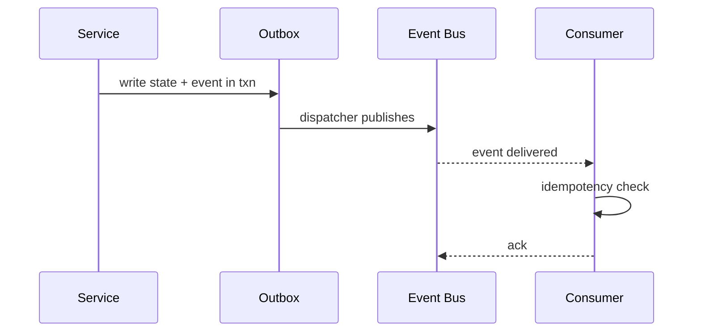

# Event Bus & Outbox Infrastructure

The **Event Bus + Outbox** pattern guarantees reliable, exactly-once delivery of domain events across Storo’s services.

---

## 🎯 Purpose
- Ensure **atomic state + event publishing**.  
- Enable **loose coupling** between services.  
- Provide **auditability** of all domain events.  
- Support **retries & idempotency** safely.

---

## 🛠 Responsibilities
- Each service writes events to a **local outbox table** within the same DB transaction as state changes.  
- A dispatcher process drains the outbox and publishes to the bus.  
  - Batch size, concurrency, and backoff are configurable.  
  - Exponential backoff with jitter on publish failures.  
  - DLQ on repeated failures after `RETRY_MAX`.  
- Consumers are idempotent and dedupe events.  
- Provide metrics, retries, and dead-letter handling.

---

## 🔌 Interfaces

### Events
- Topics: `transfers.*`, `ledger.*`, `compliance.*`, `recon.*`  
- Envelope:  
```json
{
  "eventId": "uuid",
  "type": "transfers.settled",
  "occurredAt": "2025-08-26T10:15:01Z",
  "transferId": "tr_123",
  "payload": { ... }
}
```

### Admin
- `GET /live`, `GET /ready`, `GET /metrics`, `GET /version`

---

## 🗄 Data Model
- `outbox` (id, eventType, payload, state=PENDING|SENT|FAILED, createdAt, attempts, lastError?)  
- `inbox` (for dedupe, optional: eventId, processedAt)  

---

## 📐 Sequence



---

## 🚨 Failure Modes
- **Dispatcher crash** → resume from last PENDING.  
- **Duplicate delivery** → consumer dedupe by eventId.  
- **Bus outage** → outbox backlog grows, alert ops.  

---

## 📊 Observability
- Metrics: 
  - `event_outbox_backlog{service}`  
  - `event_publish_lag_seconds{service}`  
  - `event_consumer_lag_seconds{service,topic}`  
- Logs: structured with eventId, transferId.  
- Alerts: backlog > SLA.

---

## 🔐 Security
- Encrypt outbox payloads at rest if PII present.  
- Access controls on bus topics.  

---

## 🧭 Runbooks
- **Backlog spike** → check bus health, dispatcher logs.  
- **Consumer lag** → verify consumer ack logic.  
- **Duplicate flood** → inspect dedupe store.  

---
